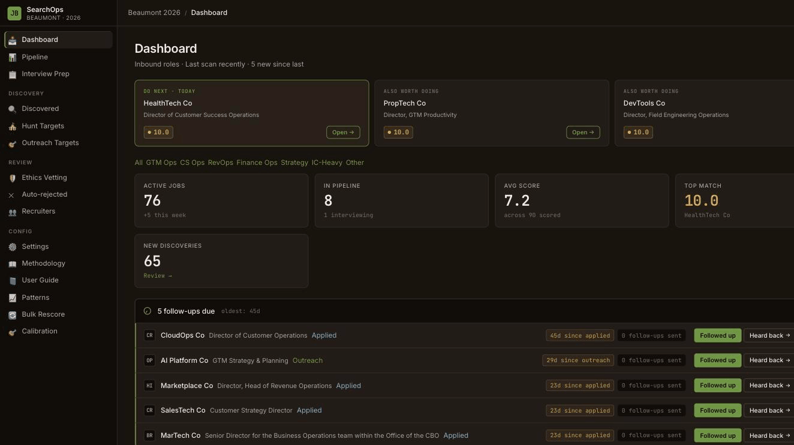
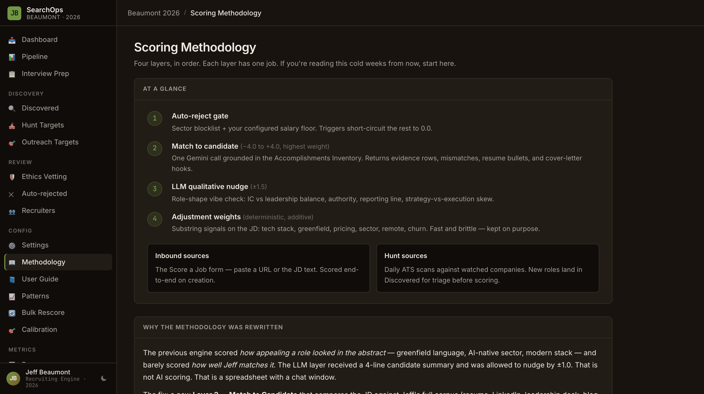

# SearchOps

A personal job search engine that flips the ATS model: instead of companies scoring
you, you score companies against your own criteria, corpus, and career goals.

Built for one job search. Designed to be forked for yours.

## Why I built this

Standard job searching is backwards. You apply to hundreds of roles, most fit lands in a spreadsheet or an ATS, and you're left hoping that scoring someone else's algorithm gets it right. I built SearchOps because I wanted to flip it: score the companies and roles against my own career, my criteria, and what I'm actually looking for.

The first version was bad. It took the JD, pulled a generic 4-line candidate summary, ran a Gemini call that returned a score with a ±1.0 nudge applied. I called it AI scoring. It was a spreadsheet with a chat window. The problem was obvious once I stopped building and started using it: the score had no grounding in anything I'd actually done. It couldn't connect "you managed a $50M renewal cohort" to "this role needs someone who's scaled CS ops." So I rebuilt.

Track B grounds the score in evidence. It pulls from my Accomplishments Inventory (a structured record of every metric, project, and outcome from fifteen years), builds an evidence table — one row per JD requirement — matching each requirement to specific work history, and generates tailored resume bullets and cover letter hooks. The Accomplishments Inventory is the core move. Everything else flows from there.

It works. Over 90 jobs scored across a 168-job intake funnel. The engine is built so an 8+ is rare and earned: surface signals cap out at 6.0, and anything above 7.0 has to pass five must-haves or it gets clamped back down. Tier A targets like Anthropic, Cohere, Weights & Biases, Vercel, Cloudflare, Notion, Zapier, Postman, Airtable, Pinecone, LangChain, Twilio, and Okta running daily ATS scans. The rest is handled automatically: tracking the pipeline, prepping per-company question banks, generating tailored application materials.

Fork it if it helps. The real move is the method: ground your scoring in evidence from your actual work history, not summary keywords.

The full story — including how a non-developer shipped this by directing AI agents through work packages, ADRs, and verification gates — is in the [case study](docs/case-study.md) (see "How this was built") and the [actual build spec](docs/build/searchops-rebuild.md) used to run the rebuild.

---

## What it does

- **Scores jobs on a 0–10 scale** across four layers: auto-reject rules, LLM match
  against your accomplishments corpus, qualitative role-shape analysis, and
  deterministic keyword signals (tech stack, greenfield/upcycling, pricing model,
  sector, remote).
- **Generates resume + cover-letter output** grounded in your accomplishments —
  tailored bullets, a role-specific summary, and cover-letter hooks.
- **Tracks the full pipeline** from discovered → outreach → interviewed → offer →
  decision, with strategy briefs, interview question banks, and transcript analysis.
- **Runs a discovery engine** that scans ATS boards at target companies and surfaces
  matching roles automatically.

Scoring is calibrated to be ruthless: an 8+ is rare. Most roles land 3–6.

---

## Screenshots

**Dashboard** — active jobs, pipeline stage counts, avg score, new discoveries, and follow-up queue.



**Scoring Methodology** — the four-layer architecture documented in the app. Every weight, every signal, every override is visible here.



---

## Three ways to add jobs

### 1. Add by URL (default — no setup required)

Paste a job URL into the app. SearchOps fetches and scores it in one step. Nothing
else needs to be configured to use this path.

### 2. Hunt Targets (proactive discovery)

Add companies you want to track to `hunt_targets.yaml` (or the in-app Settings UI).
SearchOps scans their ATS boards on a schedule and surfaces matching roles
automatically. Best for companies you're actively interested in.

### 3. Outreach Targets

Companies you've manually surfaced through networking or research, where a role
might not be posted yet. Track them separately from discovery finds.

---

## Stack

| Layer | Tech |
|---|---|
| Compute | [Modal](https://modal.com) (serverless Python) — or any ASGI host |
| LLM | Gemini (default) · Anthropic · OpenAI — switchable via `LLM_PROVIDER` |
| Storage | SQLite (local dev) · Modal Volume (production) |
| UI | HTMX + Jinja2 templates, Tailwind CDN |
| Notifications | Slack webhook (optional) |
| Inbound | Score a Job form (URL or pasted JD) · Automated ATS discovery scan |

---

## Quickstart (local dev)

### Prerequisites

- Python 3.12+
- A Gemini, Anthropic, or OpenAI API key (pick one)

### 1. Clone and install

```bash
git clone https://github.com/jeffsleft/searchops.git
cd searchops
python -m venv .venv && source .venv/bin/activate
pip install -r requirements.txt
```

### 2. Configure

```bash
cp .env.example .env
```

Open `.env` and fill in at minimum:

```
APP_PASSWORD=your-chosen-password
SESSION_SECRET=at-least-32-random-characters
GEMINI_API_KEY=your-api-key    # or ANTHROPIC_API_KEY / OPENAI_API_KEY
LLM_PROVIDER=gemini            # gemini | anthropic | openai
```

### 3. Set up your candidate profile

```bash
cp candidate_profile.example.yaml candidate_profile.yaml
```

Edit `candidate_profile.yaml` with your real criteria. This file is gitignored —
it never leaves your machine. See the inline comments for each field.

### 4. Run

```bash
python run_local.py
```

Open `http://localhost:8000` and log in with `APP_PASSWORD`.

---

## Deploy to Modal

```bash
# Install Modal CLI and authenticate
pip install modal
modal setup

# Create your secrets (one-time)
modal secret create recruiting-secrets \
  APP_PASSWORD=... \
  SESSION_SECRET=... \
  GEMINI_API_KEY=... \
  SLACK_WEBHOOK_URL=...    # optional

# Deploy
modal deploy app/main.py
```

The deployment URL appears in the Modal dashboard. The app runs on Modal's
free tier for light usage.

### Hosting beyond Modal

Modal is the reference deploy, but the app is a plain Starlette ASGI app
(`app/asgi.py`) with no Modal coupling in the request path — so it runs on any
ASGI host (`uvicorn app.asgi:app`), in a container, or behind Cloudflare, and the
SQLite layer ports to Postgres/D1 cleanly. See **[docs/hosting.md](docs/hosting.md)**.

---

## Add your accomplishments corpus

The highest-weight scoring signal (Layer 2) is grounded in a `.docx` corpus of
your accomplishments — every metric, project, and differentiator from your
resume, LinkedIn, and portfolio.

Create `data/Accomplishments_Inventory.docx` using this structure:

```
Heading 1: Company / Role  (e.g. "AcmeSaaS — Head of Revenue Operations")
  Heading 2: Theme         (e.g. "Renewal Operations")
    • Accomplishment bullet with metric  #optional-tag
  Heading 2: Another Theme
    • ...

Heading 1: Differentiators
  • Cross-functional moat: ...
  • Technical edge: ...
```

If the file is absent, Layer 2 scores 0.0 and the UI surfaces a warning —
the rest of the engine still runs. See `app/scoring/corpus.py` for the parser.

---

## Configure scoring

`candidate_profile.yaml` controls all scoring parameters. Key settings:

```yaml
scoring:
  base_score: 3.5           # anchor (before any adjustments)
  max_l4_positive: 2.5      # cap on positive keyword bonuses
  top_band_gate_threshold: 7.0   # scores above this require all 5 must-haves
  top_band_gate_enabled: true

compensation:
  base_min: 160000          # auto-reject if JD salary is below this floor

# No-go sectors, ethics reasons, and title filters are
# managed in the Settings UI and stored in SQLite.
```

Full methodology is documented in the in-app Methodology page (`/settings/methodology`).

---

## LLM provider

Switch providers by setting `LLM_PROVIDER` in your `.env` or Modal Secret:

| Value | Provider | Notes |
|---|---|---|
| `gemini` (default) | Google Gemini | Automatic Anthropic fallback on rate limit |
| `anthropic` | Anthropic Claude | BYO key via `ANTHROPIC_API_KEY` |
| `openai` | OpenAI / compatible | BYO key via `OPENAI_API_KEY`; supports `OPENAI_BASE_URL` for local models |

---

## Hunt Targets (proactive discovery)

Copy the example and add companies you want to track:

```bash
cp app/discovery/hunt_targets.example.yaml app/discovery/hunt_targets.yaml
```

Or manage targets directly from the Hunt Targets page in the app — no YAML editing
required after the first run.

---

## Project layout

```
app/
  main.py            — Modal app entry, route registration
  config.py          — env vars, profile loading
  auth.py            — session-cookie auth
  models.py          — SQLite schema + connection
  providers/         — LLM provider abstraction (Gemini, Anthropic, OpenAI)
  scoring/           — 4-layer scorer (engine, match, research, corpus, prompts)
  discovery/         — ATS clients, hunt engine, matcher
  pipeline/          — funnel tracker, strategy briefs, transcript analysis
  questions/         — interview question bank
  recruiters/        — recruiter contact management
  templates/         — Jinja2 HTML templates
  static/            — CSS assets
candidate_profile.yaml           — your scoring config (gitignored)
candidate_profile.example.yaml   — template to copy
data/
  Accomplishments_Inventory.docx — your corpus (gitignored)
seed_data/                        — demo dataset + fictional seed profile
tests/                            — pytest suite
```

---

## Running tests

```bash
pytest tests/
```

Tests run without API keys — all LLM paths are bypassed or stubbed. The seed
profile (`seed_data/seed_profile.yaml`) is used automatically when
`candidate_profile.yaml` is absent.

---

## Contributing

See [CONTRIBUTING.md](CONTRIBUTING.md).

## License

MIT — see [LICENSE](LICENSE).
